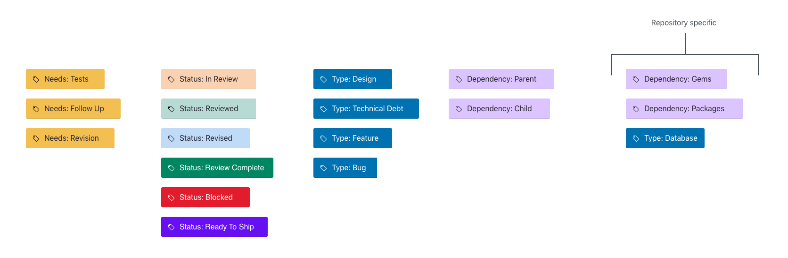

## GitHub Labels

To ensure congruency across GitHub, we enforce using our standard labels
across all of our repositories. These labels are generic and can be used
for all repositories, public and private.

If an individual repository needs custom labels, we approve on a case-by-case
basis.

### Adding to Repositories

When adding new repositories to GitHub, you can easily remove the standard
labels and add our default. We have a [simple shell script](main.sh) that
only requires a GitHub Access Token to use. Please reference the script for
usage instructions.

### Labels

**Needs**

- Needs: Tests
- Needs: Follow Up
- Needs: Revision

**Status**

_Please see our [Code Review guidelines](https://github.com/ProctorU/guides/tree/master/code-review)
for a deeper understanding of Status labels._

- Status: In Review
- Status: Reviewed
- Status: Revised
- Status: Review Complete
- Status: Ready To Ship
- Status: Blocked

**Type**

- Type: Design
- Type: Technical Debt
- Type: Feature
- Type: Bug

**Dependency**

- Dependency: Parent
- Dependency: Child

**Repository Specific**

- Dependency: Gems
- Dependency: Packages

### Colors

